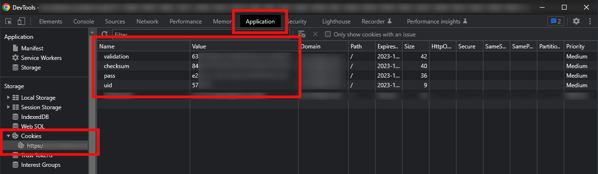

# predb.ovh is currently offline (January 8, 2023)

predb.ovh is currently offline. This means that ***ATUS is currently unusable*** until thier api is back up again or i find a different predb with free api-access.

If you know of one, gladly let me know or check for status updates on their [github](https://github.com/predbdotovh).

#

<p align="center">
  <br>
  
</p>

<h2 align="center">ATUS - Automatic Torrent Upload Script</h2>


Automatically downloads scene-releases from rss feeds and uploads them to your own tracker.

## Related Repos

- [atus-rutorrent-api](https://github.com/SteffenLoges/atus-rutorrent-api)
- [atus-tracker-api](https://github.com/SteffenLoges/atus-tracker-api)

## Features

- Comes with a nice management web interface.
- Supports multiple rss sources.
- Supports multiple fileservers.
- Supports streaming of sample videos to your clients.
- Extracts screenshots from sample videos and displays them to your clients.

## Screenshots


## Requirements

- **a server with docker installed.** See [server requirements](#server-requirements) for more information.
- **a source torrent tracker that provides a rss feed**
- **rtorrent + ruTorrent seedbox with the [atus-rutorrent-api](https://github.com/SteffenLoges/atus-rutorrent-api) plugin installed**
- **your own tracker for uploads with the [atus-tracker-api](https://github.com/SteffenLoges/atus-tracker-api) installed and configured**

### Server Requirements

ATUS itself is a lightweight application but if you want to make use of the sample video streaming feature, the server will have to transcode the sample videos.<br>
I've tested this on a Hetzner CPX11 cloud server with 2 vcores and 2GB of RAM and it worked fine but depending on amount of releases you want to process, you might need more resources.<br>
You can use my [referral link](https://hetzner.cloud/?ref=WHPxNsOJ8EEC) to get a free €20 credit.

## Installation

To deploy this project run

```bash
  docker run -d --name atus \
    -v /home/atus_data:/app/atus_data \
    -p 8000:8000 \
    -d ghcr.io/steffenloges/atus:latest
```

### or build your own image

Clone the project

```bash
  git clone https://github.com/SteffenLoges/atus.git
```

Build the image

```bash
  docker build -t atus .
```

Run with

```bash
  docker run -d --name atus \
    -v /home/atus_data:/app/atus_data \
    -p 8000:8000
```

## Configuration

Once the container is running, open http://[YOUR-SERVER-IP]:8000 in your browser.

You will be prompted to create an account and set up your settings.

You should start by configuring the upload settings as this is by far the hardest part.<br>
Make sure to test if your settings are working by clicking "Upload Test Release".<br>
**Do not proceed until the test release has been uploaded successfully.**

Once this is done, you can proceed to set up fileservers and lastly rss sources. The web interface will guide you through the process.

## Notes

ATUS relies on [predb.ovh](https://predb.ovh/) ([GitHub](https://github.com/predbdotovh)) to determine if a release is a scene release or not.

## Known Issues

- ATUS will never delete releases and related files on its own even if you delete them from the fileserver / tracker. <br>
  _An api endpoint to delete releases is planned but currently not possible due to the way [atus-tracker-api](https://github.com/SteffenLoges/atus-tracker-api)'s authentication is implemented._

- If you delete a release from the fileserver while its downloading, it will be stuck in the "Downloading" state forever and ATUS will keep spamming the fileserver with status requests. To fix this, manually delete the release from ATUS through the web interface.

- If you stop a source, ATUS will still process previously received releases from that source. This makes it look like the source is still running even though it's not.

## Common Errors

- **meta file _xxx_ is not processed**<br>
  This usually means that ATUS is already processing another release and can't process the new one until the other one is finished. Just waiting a few minutes should fix this. If this happens frequently, your server might not have enough resources to process all releases in time. <br>
  _In some cases, this error can also occur if the fileserver is unreachable, the file was deleted or your webserver has no read access to the file._

- **This torrent is for registered users only** or similar errors while adding a source rss feed<br>
  The tracker requires authentication. If the tracker offers a way to costimize the rss feed, make sure to select something like "direkt download".
  If the tracker doesn't offer this, you can add the trackers cookies during the rss feed setup. You can find the cookies in your browser's developer tools.<br>
   

## Tech Stack

**Frontend:** Vue 3, Vuetify 3

**Backend:** Go

## License

[MIT](https://choosealicense.com/licenses/mit/)
